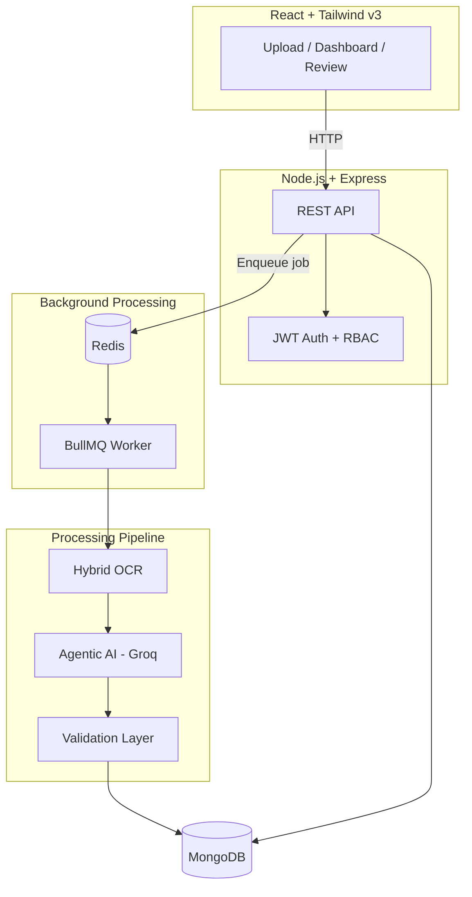

# Utility Bill Extraction Platform

Agentic AI-powered platform for processing Indian utility bills and invoices. Upload PDFs or images, run hybrid OCR, extract structured data with Groq LLM, validate results, and approve via human review.

Built for the **Zero Carbon One** assignment — focused on clean architecture, maintainable code, and practical AI workflow design.

## Submission

| Requirement | Link / Location |
|-------------|-----------------|
| **GitHub Repository** | Add your repo URL here after publishing |
| **Demo Video (~5 min)** | [Watch on Google Drive](https://drive.google.com/file/d/17dlVf0NvIYsBrRe-6T7d4abaz6cyS20h/view?usp=sharing) |
| **Architecture Diagram** | [Architecture](#architecture) section below |
| **Docker Setup** | [Docker](#docker) section below |
| **Setup & Design Docs** | This README |

### Demo walkthrough (covered in video)

1. **Upload process** — Upload page: drag-and-drop, upload progress, processing status
2. **OCR workflow** — Review page: OCR method badge + raw OCR output (`pdf_parse` / `hybrid_ocr` / `tesseract`)
3. **Agentic extraction** — Review page: document type, vendor, extracted fields (classify → vendor → extract via Groq)
4. **Validation process** — Review page: validation warnings; re-runs on save/approve
5. **Final structured output** — Review page: standardized JSON + approve → stored in MongoDB

## Architecture



### Processing Flow

```
Upload → Queue (BullMQ) → OCR → AI Extraction → Validation → MongoDB → Human Review → Approval
```

| Step | What happens |
|------|----------------|
| **Upload** | User uploads PDF/PNG/JPG via React (single or multiple). File stored on disk + MongoDB buffer, job queued in Redis. |
| **OCR** | PDF: try `pdf-parse` first. If text quality is poor, run Tesseract on page images and **combine** with any partial direct text. Images go directly to Tesseract. |
| **AI Agent** | Three Groq LLM calls: (1) classify document type, (2) detect vendor, (3) extract type-specific fields. |
| **Validation** | Rule-based checks: missing fields, incorrect units, negative values, duplicate invoices. Re-runs on save/approve. |
| **Review** | User previews original document, edits extracted JSON, saves corrections, approves final output. |

## Tech Stack

| Layer | Technology |
|-------|------------|
| Frontend | React 19, Tailwind CSS v3, Vite, Axios, React Router |
| Backend | Node.js, Express 5 |
| Database | MongoDB + Mongoose |
| Queue | BullMQ + Redis |
| OCR | pdf-parse, pdf2pic, Tesseract.js |
| AI | Groq API (Llama 3.3 70B) |
| Auth | JWT + bcrypt, RBAC (admin/user) |
| Deployment | Docker + Docker Compose |

## AI Approach

We use **Option B (Cloud API)** via **Groq** for the assignment:

- **Why Groq?** Fast inference, free tier available, good for structured extraction from OCR text.
- **Agentic workflow:** Sequential LLM tasks (classify → vendor → extract) rather than one monolithic prompt — easier to debug and extend.
- **OCR stays local:** Tesseract runs in-process; only the text (not the file) is sent to Groq.

## Supported Document Types

| Type | Key Fields Extracted |
|------|---------------------|
| Electricity Bill | utility provider, consumer/account number, billing period, kWh, demand, GST, total |
| Diesel Invoice | supplier, invoice #, date, litres, rate, total |
| Coal Invoice | supplier, invoice #, grade, tonnes, GCV, moisture %, total |
| Water Bill | supplier, billing period, consumption volume, unit, total |
| Natural Gas Bill | supplier, billing period, SCM consumption, total |
| LPG Bill | supplier, quantity (kg), billing period, total |
| Steam Bill | supplier, steam quantity (tonnes), pressure, total |
| Renewable Energy Certificate | issuer, certificate #, energy (MWh), technology, total |
| Fuel Transport Invoice | transporter, fuel type, quantity, origin/destination, freight, total |

## Sample Test Documents

Three sample PDFs are included for testing. Upload them via the UI to verify the full pipeline:

```bash
npm run generate-samples   # Regenerate if needed
```

| File | Document Type |
|------|---------------|
| `sample-documents/sample-electricity-bill-tata-power.pdf` | Tata Power electricity bill |
| `sample-documents/sample-diesel-invoice-iocl.pdf` | IOCL diesel purchase invoice |
| `sample-documents/sample-coal-invoice.pdf` | Coal India coal purchase invoice |

## Prerequisites

- Node.js 20+
- MongoDB
- Redis
- GraphicsMagick + Ghostscript (for PDF → image OCR fallback)
- Groq API key from [console.groq.com](https://console.groq.com)

### macOS (local dev)

```bash
brew install mongodb-community redis graphicsmagick ghostscript
brew services start mongodb-community
brew services start redis
```

## Local Development

### 1. Clone and configure

```bash
git clone <your-repo-url>
cd utility-bill-extractor

# Backend env
cp backend/.env.example backend/.env
# Edit backend/.env — set GROQ_API_KEY and JWT_SECRET
```

### 2. Backend

```bash
cd backend
npm install
npm run dev        # API server on :8000
npm run worker:dev # Separate terminal — background processor
```

### 3. Frontend

```bash
cd frontend
npm install
npm run dev        # http://localhost:5173
```

### 4. First user

Register at `/register`. The **first registered user becomes admin** automatically.

## Docker

The application runs with a single command as required by the assignment:

```bash
# 1. Create root .env (same folder as docker-compose.yml)
cp .env.example .env

# 2. Edit .env and set:
#    GROQ_API_KEY=your_groq_api_key
#    JWT_SECRET=any_long_random_secret

# 3. Start all services
docker-compose up --build
```

| Service | URL |
|---------|-----|
| Frontend | http://localhost:3000 |
| Backend API | http://localhost:8000 |
| Health check | http://localhost:8000/api/health |

**Services started:** `mongo`, `redis`, `backend`, `worker`, `frontend`

> Redis and MongoDB run inside Docker only (no host port binding) to avoid conflicts with local installs.

## API Endpoints

| Method | Endpoint | Description |
|--------|----------|-------------|
| POST | `/api/auth/register` | Register user |
| POST | `/api/auth/login` | Login |
| GET | `/api/auth/me` | Current user |
| POST | `/api/documents/upload` | Upload file(s) |
| GET | `/api/documents` | List documents |
| GET | `/api/documents/:id` | Get document detail |
| PATCH | `/api/documents/:id` | Save user corrections |
| POST | `/api/documents/:id/approve` | Approve extraction |
| GET | `/api/documents/:id/file` | Download/preview original file |
| GET | `/api/users` | List users (admin) |
| PATCH | `/api/users/:id/role` | Update user role (admin) |
| DELETE | `/api/users/:id` | Delete user (admin) |

## MongoDB Schema

**User:** name, email, password (hashed), role (`admin` | `user`)

**Document:** userId, file metadata, fileData (binary in MongoDB), status, processingStage, processingProgress, ocrText, ocrMethod, extractedData, correctedData, validationWarnings, approvalStatus

## Standardized Output Example

```json
{
  "document_type": "electricity_bill",
  "vendor": "Tata Power",
  "bill_date": "2026-01-15",
  "billing_period": "Dec 2025",
  "consumption_kwh": 154230,
  "total_amount": 1540000,
  "confidence_score": 0.95
}
```

## Design Decisions & Assumptions

1. **Hybrid OCR** — Most digital PDFs have embedded text; OCR fallback handles scanned bills. Requires GraphicsMagick + Ghostscript for PDF→image conversion.
2. **Separate worker process** — Keeps API responsive; BullMQ handles retries and concurrency.
3. **Sequential AI agents** — Three Groq calls (classify → vendor → extract) instead of one prompt — better accuracy and debuggability.
4. **Rule-based validation** — Complements LLM output with deterministic checks (missing fields, incorrect units, duplicates, negative values).
5. **MongoDB stores all artifacts** — OCR text, AI output, user corrections, approval status, and file binary (`fileData`).
6. **RBAC** — Admin sees all documents and manages users; regular users see only their own uploads.
7. **First user = admin** — Simplifies demo setup without a seed script.
8. **Indian utility context** — Vendor examples (Tata Power, IOCL, BSES) and field schemas match assignment spec.
9. **Cloud AI (Option B)** — Groq Llama 3.3 70B for extraction; OCR runs locally via Tesseract.

## Demo Video

**Link:** [Screen Recording — Full Demo](https://drive.google.com/file/d/17dlVf0NvIYsBrRe-6T7d4abaz6cyS20h/view?usp=sharing)

The video demonstrates:
- Register / login
- Upload utility bill (PDF)
- Processing status on dashboard
- OCR output and extraction results on review screen
- Validation warnings
- Edit, save, and approve flow
- Final standardized JSON output

## Project Structure

```
utility-bill-extractor/
├── backend/
│   ├── src/
│   │   ├── config/       # DB, Groq
│   │   ├── controllers/  # Auth, documents
│   │   ├── middleware/   # Auth, upload
│   │   ├── models/       # User, Document
│   │   ├── queue/        # BullMQ queue + worker
│   │   ├── routes/
│   │   └── services/     # OCR, extraction, validation
│   ├── server.js
│   └── worker.js
├── frontend/
│   └── src/
│       ├── api/
│       ├── components/
│       ├── context/
│       └── pages/
├── sample-documents/     # Test PDFs for demo
├── scripts/              # Sample PDF generator
├── docker-compose.yml
└── README.md
```

## License

MIT
